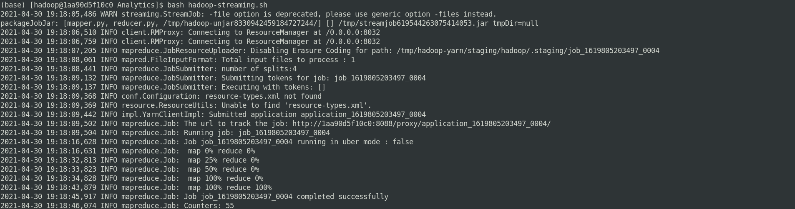
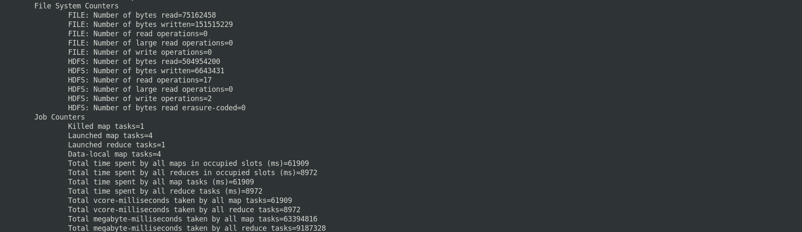

# Análise de Logs de Servidores Web usando Hadoop MapReduce

Este artigo foi inspirado no conteúdo do curso de Formação de Cientista de Dados, módulo Engenharia de Dados com Hadoop e Spark na Data Science Academy [http://www.datascienceacademy.com.br](http://www.datascienceacademy.com.br) 

O Hadoop MapReduce é uma ferramenta para escrever aplicativos que processam grandes quantidades de dados em paralelo em clusters de hardware de maneira confiável e tolerante a falha. 

>Qual é a melhor solução? depende! O importante é resolver o problema do cliente. 

### Pré-requisitos:  

- Máquina local ou virtual com sistema operacional Linux;
- [Python Fundamentos para Análise de Dados](https://www.datascienceacademy.com.br/course?courseid=python-fundamentos);
- [Java(TM) SE Runtime Environment (build 1.8.0_281-b09)](https://www.java.com/pt-BR/download/ie_manual.jsp?locale=pt_BR);
- [Docker instalado e configurado](https://www.docker.com/get-started); 
- [Apache Hadoop Pseudo Cluster instalado e configurado](https://github.com/carlosemsantana/docker-hadoop);
- [Anaconda Python instalado](https://www.anaconda.com/products/individual#Downloads);

### Definição do problema

Saber quantas conexões foram feitas por cada IP listado nos Logs dos Servidores Web.

### Objetivo
Criar um programa para contabilizar quantas conexões foram feitas.

### Atividades
    1. Coleta dos logs dos servidores web;
    2. Carregar o conjunto de dados no HDFS;
    3. Programação;
    4. Copiar o programa para o ambiente Hadoop;
    5. Executar o Job MapReduce;

**Coleta dos logs dos servidores web**

A coleta e análise dos logs gerados nos servidores, podem ajudar detectar e diagnosticar uma invasão ou falha em algum serviço.

Arquivo analisado: **web_server.log**
~~~bash
(base) [hadoop@1aa90d5f10c0 Datasets]$ head -n 6 web_server.log
10.223.157.186 - - [15/Jul/2009:14:58:59 -0700] "GET / HTTP/1.1" 403 202
10.223.157.186 - - [15/Jul/2009:14:58:59 -0700] "GET /favicon.ico HTTP/1.1" 404 209
10.223.157.186 - - [15/Jul/2009:15:50:34 -0700] "GET / HTTP/1.1" 200 9157
10.223.157.186 - - [15/Jul/2009:15:50:35 -0700] "GET /assets/js/lowpro.js HTTP/1.1" 200 10469
10.223.157.186 - - [15/Jul/2009:15:50:35 -0700] "GET /assets/css/reset.css HTTP/1.1" 200 1014
10.223.157.186 - - [15/Jul/2009:15:50:35 -0700] "GET /assets/css/960.css HTTP/1.1" 200 6206
~~~

**Carregar o conjunto de dados no HDFS**
~~~bash
$ hdfs dfs -put web_server.log /mapred/web_server.log
~~~

**Programação**

Escrevendo o script mapper.py: olhando para a estrutura dados do arquivo de log criar uma lógica que consiga extrair e organizar os dados, de tal forma, possamos analisar. 

~~~python
#!/home/hadoop/anaconda3/bin/python
import sys
for line in sys.stdin:
    data = line.strip().split(" ")
    if len(data) == 10:
        ip_address, identity, username, datetime, timezone, method, path, proto, status, size = data
        print(ip_address)
~~~

Escrevendo o script reducer.py: objetivo deste script é bem simples, contabilizar a quantidade de conexões por IP.

~~~python
#!/home/hadoop/anaconda3/bin/python
import sys
current_ip_address = None
current_ip_address_count = 0
for line in sys.stdin:
    new_ip_address = line.strip().split()
    if len(new_ip_address) != 1:
        continue

    if current_ip_address and current_ip_address != new_ip_address:
        print ("{0}\t{1}".format(current_ip_address, current_ip_address_count))
        current_ip_address_count = 0

    current_ip_address = new_ip_address
    current_ip_address_count += 1

if current_ip_address != None:
    print("{0}\t{1}".format(current_ip_address, current_ip_address_count))
~~~

**Copiar o programa para o ambiente Hadoop**

Estamos usando o Hadoop em container Docker, caso queria visite o artigo: Instalação e Configuração de um container Docker Apache Hadoop <https://github.com/carlosemsantana/docker-hadoop>. 

Para copiar conteúdo do container para máquina local, é um cópia entre pastas, porque estamos trabalhando com volumes compartilhados.

**Executar o Job MapReduce**

Hadoop streaming é um utilitário nativo que permite criar e executar Map/Reduce jobs a partir de script mapper.py e reducer.py.

~~~bash  
# Criaremos um arquivo no shell com string de geração dos jobs MapReduce. 
$ touch hadoop-dtreaming.sh

# conteúdo do arquivo:

#!/bin/bash
HADOOP_STREAMING=/opt/hadoop/share/hadoop/tools/lib
$HADOOP_HOME/bin/hadoop  jar $HADOOP_STREAMING/hadoop-streaming-3.2.2.jar \
    -input /mapred/web_server.log \
    -output /mapred/saida/web_server1 \
    -mapper mapper.py \
    -reducer reducer.py \
    -file mapper.py \
    -file reducer.py

# ajuste as permissões do arquivo:
$ chmod 775 hadoop-dtreaming.sh

# para executar o scrip digite:
$ bash hadoop-dtreaming.sh

~~~ 

**Processamento**

Concluído! 

Consultado o resultado do processamento

~~~bash
$  hdfs dfs -ls /mapred/saida/web_server
~~~

~~~bash
$  hdfs -get /mapred/saida/web_server/part-00000
~~~

Feito! o arquivo com os logs do servidor foi processado e gerado resultado no formato IP e total de conexões, agora, podemos gerar um relatório, alimentar um dashboard e apresentar os resultados ao cliente.

>Espero ter contribuido com o seu desenvolvimento de alguma forma.

[Carlos Eugênio Moreira de Santana](https://carlosemsantana.github.io/)

**Referência**

- [http://www.datascienceacademy.com.br](http://www.datascienceacademy.com.br) 
- [https://hadoop.apache.org/docs/current/hadoop-mapreduce-client/hadoop-mapreduce-client-core/MapReduceTutorial.html](https://hadoop.apache.org/docs/current/hadoop-mapreduce-client/hadoop-mapreduce-client-core/MapReduceTutorial.html) 
- <https://hadoop.apache.org/docs/r1.2.1/streaming.html#Hadoop+Streaming> 
- [https://hadoop.apache.org/docs/current/hadoop-yarn/hadoop-yarn-site/YARN.html](https://hadoop.apache.org/docs/current/hadoop-yarn/hadoop-yarn-site/YARN.html) 
- [https://hadoop.apache.org/docs/current/hadoop-project-dist/hadoop-hdfs/HdfsDesign.html](https://hadoop.apache.org/docs/current/hadoop-project-dist/hadoop-hdfs/HdfsDesign.html) 
- <https://memoria.rnp.br/newsgen/9905/logs.html>
